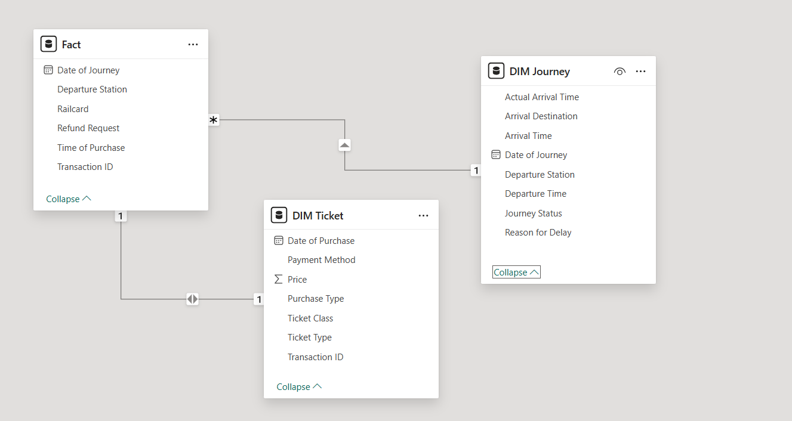

<!-- GP-DEPI Styled GitHub README (Centered Layout) -->

  <!-- Header -->
  

    <h1>🚆 GP-DEPI Railway Delay & Profit Optimization Project</h1>
    
<em>A graduation project focused on delay reduction and maximizing profit</em>

  

  <!-- Team Members -->
  

    <h2>👥 Team Members</h2>
    
<b>Basmala</b> · <b>Manar</b> · <b>Omar</b> · <b>Sarah</b> · <b>Mohamed</b> · <b>Adham</b>

  

  <!-- Project Goal -->
  

    <h2>🎯 Project Goal</h2>
    
To identify key factors causing journey delays in railway transportation and explore how reducing delay time can:

    <ul style="display:inline-block; text-align:left;">
      <li>Increase ticket sales</li>
      <li>Enhance customer satisfaction</li>
      <li>Improve operational efficiency</li>
      <li>Boost profitability through forecasting and simulation</li>
    </ul>
  

  <!-- Pipeline -->
  

    <h2>🚀 Project Pipeline</h2>
    <ol style="text-align:left; display:inline-block; max-width:700px;">
      <li><b>Data Cleaning & Preprocessing</b>
        <ul><li>Removed nulls, fixed inconsistent time formats</li><li>Merged arrival times with date to build usable datetime columns</li></ul>
      </li>
      <li><b>Data Modeling (Power BI)</b>
        
Structured data model with relationships to build insights.

        
      </li>
      <li><b>Exploratory Data Analysis (EDA)</b>
        <ul>
          <li>Most delayed stations, times, and ticket types</li>
          <li>Calculated % of delayed vs on-time journeys</li>
          <li>Identified rush hours and refund triggers</li>
        </ul>
      </li>
      <li><b>KPI Definition</b>
        <ul>
          <li>Average Delay Time</li>
          <li>Ticket Sales by Journey Date</li>
          <li>Delay to Refund Ratio</li>
          <li>% of delayed trips per week</li>
        </ul>
      </li>
      <li><b>What-If Analysis (Tableau)</b>
        <blockquote>Simulated the impact of reducing delay by X% → Predicted boost in ticket sales and revenue</blockquote>
      </li>
      <li><b>Forecasting & Demand Prediction (Python)</b>
        <ul>
          <li>ARIMA & Random Forest models</li>
          <li>Predicted daily ticket sales for the next month</li>
          <li>Supported resource allocation decisions</li>
        </ul>
      </li>
    </ol>
  

  <!-- Stakeholder Analysis -->
  

    <h2>🔍 Stakeholder Analysis</h2>
    <table style="margin:auto; border-collapse:collapse;">
      <thead>
        <tr style="background:#f0f0f0;">
          <th style="padding:10px;">Stakeholder</th>
          <th style="padding:10px;">Role</th>
          <th style="padding:10px;">Importance</th>
        </tr>
      </thead>
      <tbody>
        <tr><td>Railway Operators</td><td>Improve scheduling & delays</td><td>High</td></tr>
        <tr><td>Passengers</td><td>Understand delay trends</td><td>High</td></tr>
        <tr><td>Business Analysts</td><td>Decision-making support</td><td>Medium</td></tr>
        <tr><td>Customer Service</td><td>Handle complaints & refund requests</td><td>Medium</td></tr>
        <tr><td>Finance Teams</td><td>Revenue impact analysis</td><td>Medium</td></tr>
      </tbody>
    </table>
  

  <!-- Dashboards -->
  

    <h2>📊 Tableau Dashboards</h2>
    

      
<b>Operations Dashboard</b>

        
      
<b>Executive Dashboard</b>

        
      
<b>Customer Service Dashboard</b>

      
    

  

  <!-- Forecasting -->
  

    <h2>📈 Ticket Demand Prediction (Next Month)</h2>
    
Random Forest forecasting helps staff plan proactively based on estimated daily ride counts.

  

  <!-- Gantt Chart -->
  

    <h2>📅 Gantt Chart & Task Assignment</h2>
    
    <table style="margin:20px auto; border-collapse:collapse;">
      <thead>
        <tr style="background:#f0f0f0;">
          <th style="padding:10px;">Task</th>
          <th style="padding:10px;">Assigned To</th>
          <th style="padding:10px;">Start</th>
          <th style="padding:10px;">End</th>
          <th style="padding:10px;">Status</th>
        </tr>
      </thead>
      <tbody>
        <tr><td>Data Cleaning</td><td>Manar</td><td>Feb 10</td><td>Feb 17</td><td>✅</td></tr>
        <tr><td>Power BI Modeling</td><td>Sarah</td><td>Feb 20</td><td>Feb 23</td><td>✅</td></tr>
        <tr><td>SQL Modeling</td><td>Adham</td><td>Mar 1</td><td>Mar 8</td><td>✅</td></tr>
        <tr><td>EDA</td><td>Basmala</td><td>Mar 10</td><td>Mar 17</td><td>✅</td></tr>
        <tr><td>Forecasting</td><td>Mohamed</td><td>Apr 10</td><td>Apr 17</td><td>✅</td></tr>
        <tr><td>Tableau Dashboards</td><td>Omar & Sarah</td><td>Apr 20</td><td>Apr 24</td><td>✅</td></tr>
      </tbody>
    </table>
  

  <!-- Tools -->
  

    <h2>🧠 Tools & Technologies</h2>
    
<b>Python</b> · <b>SQL</b> · <b>Tableau</b> · <b>Power BI</b>

    <p style="font-size:
