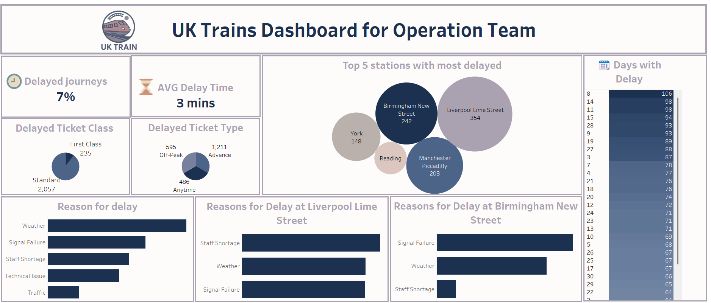

# GP-DEPI Railway Delay & Profit Optimization Project

A graduation project by the GP-DEPI team focused on minimizing railway journey delays while maximizing company **profit** and **customer satisfaction**.

---

## 👥 Team Members

- **Basmala** 
- **Manar**   
- **Omar**    
- **Sara**    
- **Mohamed** 
- **Adham**   
---

## 🎯 Project Goal

To identify key factors causing journey delays in railway transportation and to explore how reducing delay time can:

- Increase ticket sales  
- Enhance customer satisfaction  
- Improve operational efficiency  
- Boost profitability through forecasting and simulation

---

## 🚀 Project Pipeline

1. **Data Cleaning & Preprocessing**  
   - Removed nulls, fixed inconsistent time formats  
   - Merged arrival times with date to build usable datetime columns

2. **Exploratory Data Analysis (EDA)**  
   - Most delayed stations, times, and ticket types  
   - Calculated % of delayed vs on-time journeys  
   - Identified rush hours and top refund-request triggers

3. **KPI Definition**  
   - Average Delay Time  
   - Ticket Sales by Journey Date  
   - Delay to Refund Ratio  
   - % of delayed trips per week

4. **What-If Analysis** *(Tableau)*  
   > Simulated the impact of reducing delay by X%  
   > → Predicted boost in ticket sales and revenue

5. **Forecasting & Demand Prediction** *(Python)*  
   - Built ARIMA & Random Forest models  
   - Predicted daily ticket sales for the next month  
   - Helped in demand estimation & resource allocation

---

## 📊 Tableau Dashboards

We built Three dashboards tailored for different stakeholders:

- **Operations Dashboard**  
  Focuses on delay patterns, reasons, and station performance.

- **Executive Dashboard**  
  Highlights revenue impact, KPIs, and What-If simulations to support strategic decisions.

  **Customer Service Dashboard**  
  Visualizes refund requests, delay complaints, most affected routes, and overall passenger experience to help improve service quality.

---
### 📸 Dashboard Snapshots

| Operations Dashboard | Executive Dashboard | Customer Service Dashboard |
|----------------------|---------------------|-----------------------------|
|  |  |  |

## 📈 Ticket Demand Prediction (Next Month)

Using historical journey data, a Random Forest model was trained to forecast daily ride counts for the upcoming month.  
The company can now plan staff, trains, and ticket pricing **proactively**.

---

## 📅 Gantt Chart & Task Assignment

| Task                    | Assigned To | Start Date | End Date   | Status     |
|-------------------------|-------------|------------|------------|------------|
| Data Cleaning           | Omar        | Mar 1      | Mar 4      | ✅ Done     |
| EDA & Analysis          | Basmala     | Mar 5      | Mar 9      | ✅ Done     |
| SQL Modeling            | Nour        | Mar 10     | Mar 13     | ✅ Done     |
| Forecasting Models      | Basmala     | Mar 14     | Mar 18     | ✅ Done     |
| Tableau Dashboards      | Nour        | Mar 19     | Apr 1      | ✅ Done     |
| Final Reporting         | Whole Team  | Apr 2      | Apr 5      | ✅ Done     |

---

## 🧠 Tools & Technologies

- **Python**: pandas, seaborn, matplotlib, ARIMA, Random Forest  
- **SQL**: used to model tables & filter clean data  
- **Tableau**: dashboards, simulation, visuals  
- **Excel**: early preprocessing, time formatting

---

## 🏁 Conclusion

Our project proved that a **1% reduction in average delay** can increase ticket sales by an estimated **1.8–2.3%**, improving both revenue and satisfaction.  
Forecasting demand gave the company forward visibility to make smarter decisions.

---

## 🔗 Contact

For inquiries or feedback, reach out to **Basmala** via [LinkedIn](https://www.linkedin.com).
